# Active Directory & Microsoft Entra ID Hybrid Identity

**Windows Server 2025 · AD DS · Microsoft Entra ID · Entra Cloud Sync · Hybrid Identity · IAM · PowerShell · Hyper-V**

| | |
|---|---|
| **Portfolio Area** | Identity & Access Management (IAM) |
| **Owner** | Anthony Arthur |
| **Environment** | Personal cybersecurity homelab |
| **Documentation** | Objective, architecture, implementation, validation, troubleshooting, artifacts, lessons learned, interview explanation, resume and LinkedIn content |

---

## 1. Project Objective

Build a working hybrid identity environment connecting the existing on-premises Windows Server 2025 Active Directory domain **arthurlab.test** to Microsoft Entra ID using Microsoft Entra Cloud Sync. The project validates controlled provisioning, ongoing attribute synchronization, source-of-authority behavior, hybrid offboarding, and synchronization troubleshooting.

**Environment**

- Windows 11 Pro host with Hyper-V
- DC01 — Windows Server 2025 Standard Evaluation, AD DS and DNS
- On-premises domain: arthurlab.test
- Microsoft Entra tenant: ArthurLab
- Cloud identity suffix used for pilot user: aarthur89gmail.onmicrosoft.com
- Microsoft Entra provisioning agent / Cloud Sync
- PowerShell and Entra admin center

**Target workflow:** Create/prepare AD identity → scope pilot synchronization → provision to Entra → validate hybrid metadata → change identity attribute on-premises → verify automatic cloud update → disable identity on-premises → verify cloud account disabled.

All PowerShell commands referenced below are consolidated in [`scripts/hybrid-identity-powershell-reference.ps1`](scripts/hybrid-identity-powershell-reference.ps1).

---

## 2. Infrastructure Readiness and Troubleshooting

DC01 initially failed to start because the Hyper-V host could not allocate the configured VM memory. Host applications were reduced/restarted as needed so the domain controller could run with the memory required for the provisioning agent.

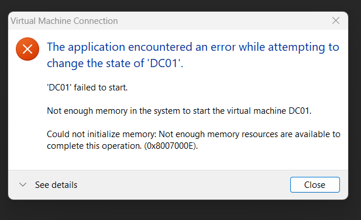

This issue was treated as an infrastructure dependency rather than an identity configuration failure.

---

## 3. AD and Internet Connectivity Health Check

The domain controller was verified as DC01 in arthurlab.test. External Microsoft name resolution initially failed because the AD DNS server had a stale forwarder. DC01 correctly used local AD DNS; the forwarder was corrected rather than pointing the DC network adapter directly at public DNS.

```powershell
Remove-DnsServerForwarder -IPAddress 172.30.224.1 -Force
Add-DnsServerForwarder -IPAddress 1.1.1.1
Clear-DnsClientCache
Resolve-DnsName login.microsoftonline.com
Test-NetConnection login.microsoftonline.com -Port 443
```

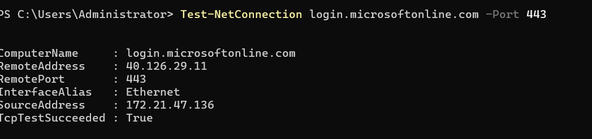

---

## 4. UPN Preparation

The AD forest uses the non-routable lab domain arthurlab.test. An alternative UPN suffix matching the tenant namespace was added so the pilot user could use a cloud-compatible sign-in name without renaming the AD domain.

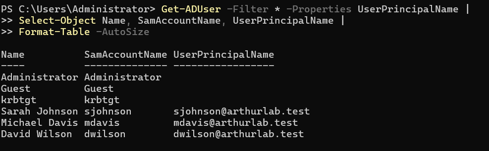

David Wilson was selected as the pilot identity and his UPN was set to **dwilson@aarthur89gmail.onmicrosoft.com**.

---

## 5. Provisioning Agent Installation and Registration

The Microsoft Entra provisioning agent was downloaded directly on DC01. The configuration wizard authenticated to Microsoft Entra, created a gMSA for the agent, and connected the arthurlab.test Active Directory domain.

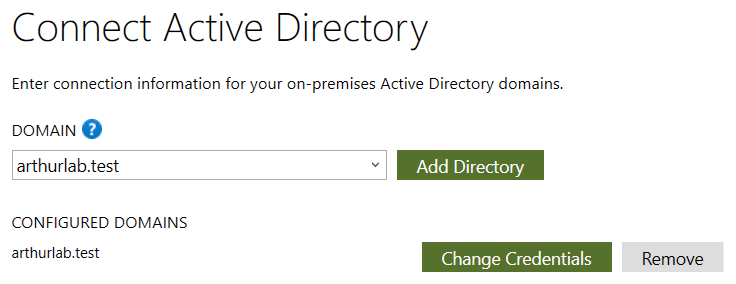

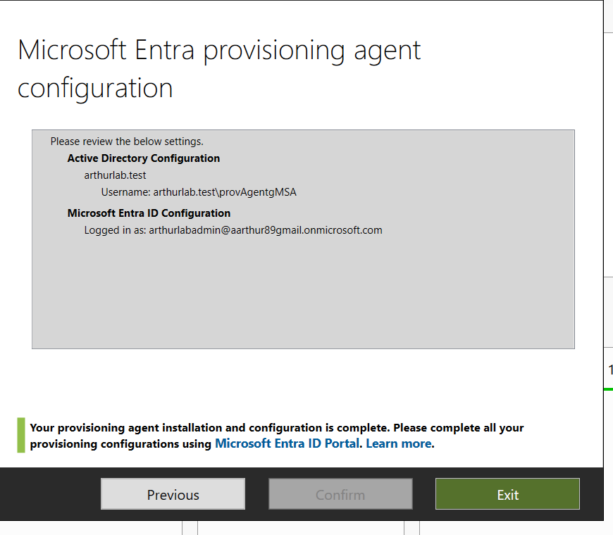

---

## 6. Cloud Sync Configuration and Pilot Scoping

A Cloud Sync configuration was created for arthurlab.test with Password Hash Sync enabled. Instead of synchronizing the entire directory, a dedicated security group was created for a controlled pilot.

```powershell
New-ADGroup -Name "GG-Entra-CloudSync-Pilot" -SamAccountName "GG-Entra-CloudSync-Pilot" -GroupCategory Security -GroupScope Global -Path "OU=ArthurLab Groups,DC=arthurlab,DC=test"
Add-ADGroupMember -Identity "GG-Entra-CloudSync-Pilot" -Members "dwilson"
```

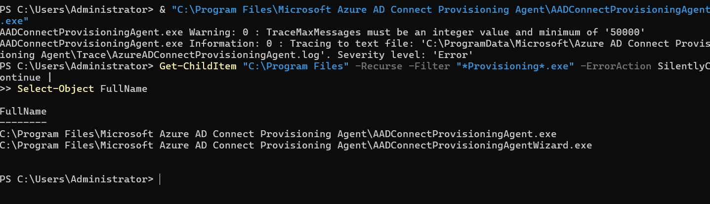

Cloud Sync was scoped to the distinguished name **CN=GG-Entra-CloudSync-Pilot,OU=ArthurLab Groups,DC=arthurlab,DC=test**. Microsoft warns that group-based scoping is best suited to pilot scenarios, which matched the lab design.

---

## 7. Provision on Demand — Initial Hybrid Provisioning

Before enabling recurring synchronization, Provision on Demand was used to test David Wilson. His AD distinguished name was confirmed before submission.

```powershell
Get-ADUser dwilson | Select-Object Name,DistinguishedName
```

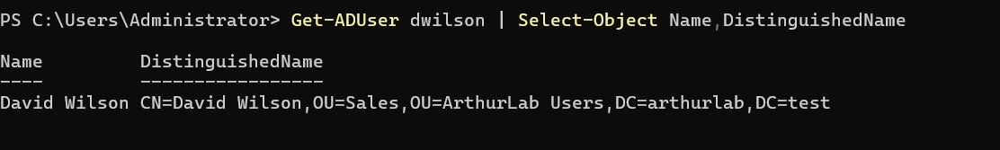

Provision on Demand successfully created **dwilson@aarthur89gmail.onmicrosoft.com** in Microsoft Entra ID and exported mapped attributes including AccountEnabled, DisplayName, Department and DnsDomainName.

---

## 8. Hybrid Identity Validation

The resulting Entra identity showed on-premises synchronization enabled, the AD SAM account name, on-premises domain, distinguished name, immutable ID and synchronized UPN. This verified that the account was a hybrid identity rather than a cloud-only identity.


---

## 9. Enable Continuous Synchronization

The configuration was reviewed before activation. Password Hash Sync was enabled, device sync and Exchange hybrid writeback were disabled, accidental deletion protection was enabled, and the object scope was restricted to the pilot security group.

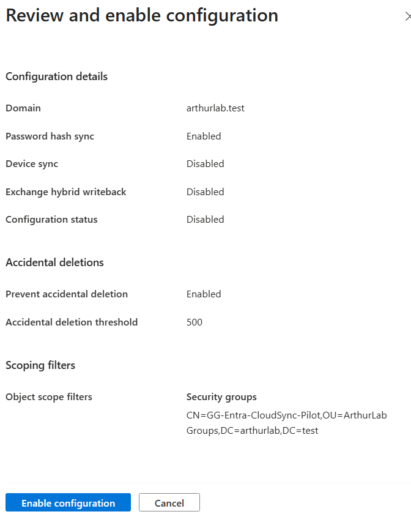

After activation, the configuration reported **Healthy** with sync direction AD to Microsoft Entra ID.

---

## 10. Automatic Attribute Synchronization Test

David Wilson started as Sales Representative in the Sales department. The job title was changed only in on-premises Active Directory to Senior Sales Representative.

```powershell
Set-ADUser dwilson -Title "Senior Sales Representative"
Get-ADUser dwilson -Properties Enabled,Title,Department,UserPrincipalName | Select-Object Name,Enabled,Title,Department,UserPrincipalName
```

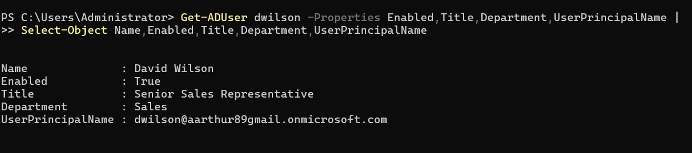

No Provision on Demand action and no manual Entra edit were used. After Cloud Sync processed the change, Entra displayed **Senior Sales Representative** while retaining Department: Sales and on-premises synchronization metadata.

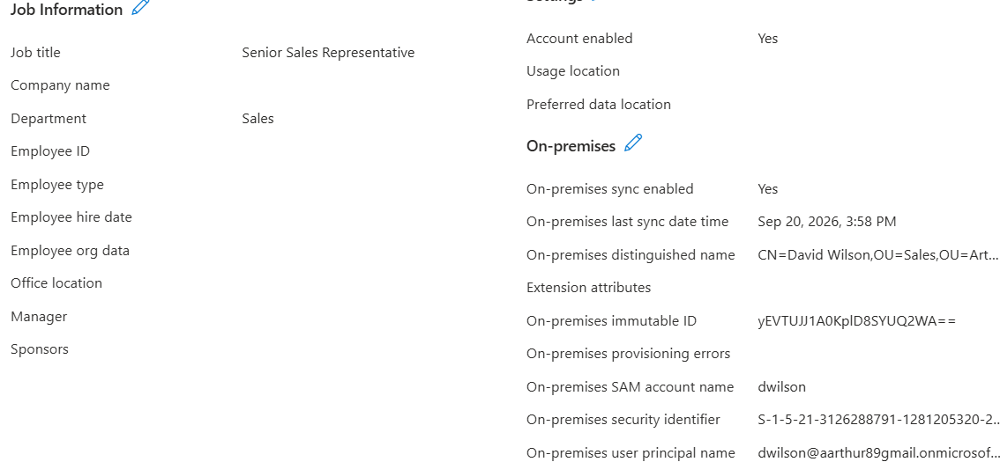

---

## 11. Provisioning Quarantine — Root Cause and Recovery

During a later session DC01 had been powered off. Microsoft Entra could no longer find an active provisioning agent for the domain and placed the configuration into provisioning quarantine.

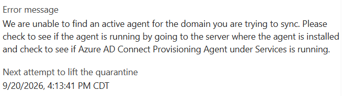

DC01 was started, the agent returned to Active status, and provisioning was restarted. The configuration returned to Healthy. The pending job-title update subsequently synchronized, proving recovery rather than a one-time manual fix.

---

## 12. Hybrid Offboarding / Leaver Test

A pre-offboarding baseline confirmed David was enabled in AD with the synchronized title, department and UPN. The identity was then disabled only in on-premises Active Directory.

```powershell
Disable-ADAccount -Identity dwilson
Get-ADUser dwilson -Properties Enabled,Title,Department,UserPrincipalName | Select-Object Name,Enabled,Title,Department,UserPrincipalName
```


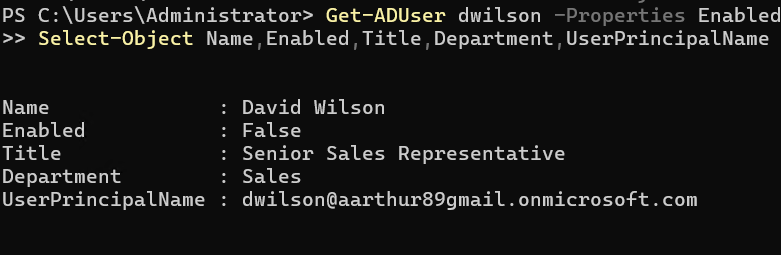

---

## 13. Entra Offboarding Validation

Cloud Sync propagated the AD account state to Microsoft Entra ID. Entra changed **Account enabled** from Yes to No while **On-premises sync enabled** remained Yes. The last sync timestamp also advanced, proving the state change originated from synchronization rather than a manual cloud edit.

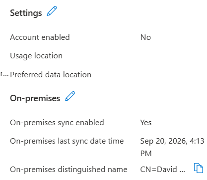

---

## 14. Final Health Validation

After provisioning, attribute updates, quarantine recovery and offboarding, the final Cloud Sync configuration remained Healthy with synchronization direction AD to Microsoft Entra ID.

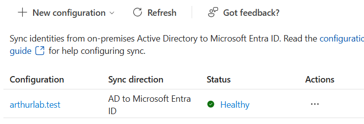

**End-to-end result:** AD source identity → controlled pilot scope → Entra provisioning → automatic attribute synchronization → operational failure/recovery → AD disablement → Entra account disabled → final synchronization health verified.

---

## 15. Troubleshooting Notes and Lessons Learned

- Hyper-V VM startup can fail when the host lacks available RAM; infrastructure health must be established before identity troubleshooting.
- A domain controller should continue using its AD DNS service; external resolution problems can be corrected through DNS forwarding rather than replacing local AD DNS with a public resolver on the adapter.
- UPN planning matters when the AD DNS domain is non-routable.
- Pilot scoping reduces the blast radius of synchronization mistakes.
- Provision on Demand is useful for validating an individual object before enabling continuous provisioning.
- Cloud Sync can quarantine a configuration when no active agent is available. Restoring the agent and restarting provisioning can recover the service without rebuilding the configuration.
- On-premises Active Directory acted as the source of authority for synchronized attributes and account state.
- Offboarding by disabling the source account preserved the identity record while revoking access in both environments.

**Key artifacts preserved:** VM memory/startup error · DNS and Microsoft 443 connectivity validation · UPN preparation · Provisioning agent setup and AD connection · gMSA / agent configuration completion · Pilot security group creation and scoping · Provision on Demand result · Hybrid user properties · Configuration review and safety settings · Automatic attribute-change evidence · Provisioning quarantine error and recovery · Pre/post offboarding evidence · Final Healthy configuration

---

## 16. Interview Explanation

"I built a hybrid identity lab connecting Windows Server Active Directory to Microsoft Entra ID using Entra Cloud Sync. I used security-group scoping for a controlled pilot deployment, provisioned an on-premises user into Entra, and validated automatic attribute and account-status synchronization. I also diagnosed a provisioning quarantine caused by the synchronization agent being offline, restored connectivity, and verified the environment returned to a healthy state."

## 17. Resume-Ready Version

- Integrated Windows Server Active Directory with Microsoft Entra ID using Entra Cloud Sync, configuring Password Hash Sync, gMSA-based provisioning, and security-group scoped synchronization.
- Provisioned and validated hybrid identities across AD and Entra ID, including synchronized UPNs, attributes, account state, and on-premises identity metadata.
- Demonstrated hybrid JML lifecycle management by synchronizing user attribute changes and account disablement from Active Directory to Microsoft Entra ID.
- Diagnosed and remediated a Cloud Sync provisioning quarantine, restoring agent connectivity and synchronization to a Healthy state while validating pending identity updates.

## 18. LinkedIn-Ready Summary

Built a hybrid identity lab integrating Windows Server 2025 Active Directory with Microsoft Entra ID using Entra Cloud Sync. Implemented a controlled pilot with security-group scoping, Password Hash Sync and a gMSA-based provisioning agent; provisioned an on-premises user to Entra; validated automatic attribute synchronization and hybrid offboarding; and diagnosed/recovered a provisioning quarantine caused by agent unavailability. Final Cloud Sync status was Healthy.
